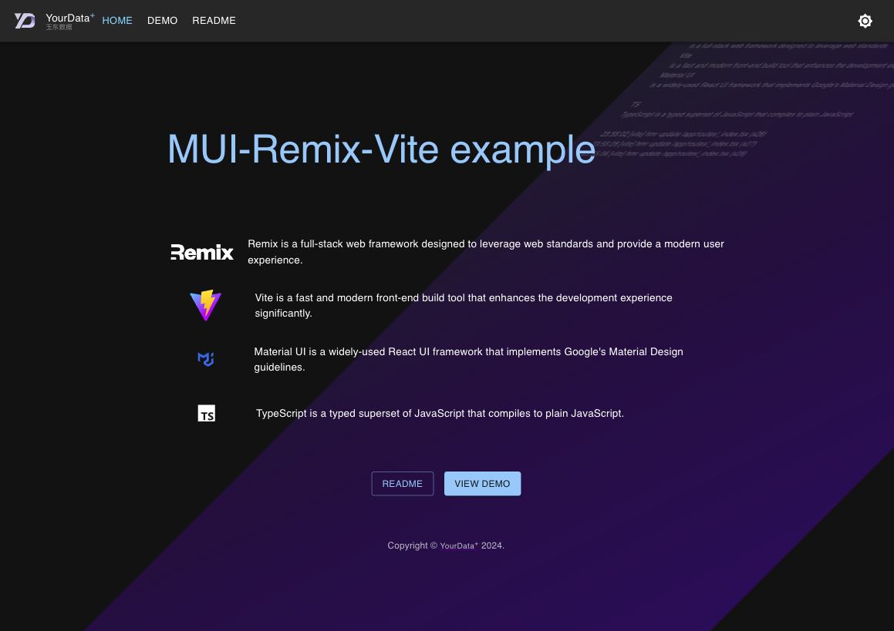

# MUI Remix Vite Template

[Live Demo](https://yourdata.plus)

[English](https://github.com/sunly8/MUI-Remix-Vite/blob/main/README.md) [中文)](https://github.com/sunly8/MUI-Remix-Vite/blob/main/README_zh.md)

## Overview

This project is a template for building modern web applications using **Material UI**, **Remix**, and **Vite**. It combines the power of these technologies to provide a robust foundation for developing responsive and visually appealing user interfaces.



## Features

- **Material UI**: Utilize a comprehensive library of customizable UI components to create beautiful and responsive layouts.
- **Remix**: Leverage a full-stack framework for optimized routing and data loading, enhancing the overall development experience.
- **Vite**: Enjoy fast build times and hot module replacement for a smooth development process.
- **Server-Side Rendering (SSR)**: Benefit from built-in SSR support for improved performance and SEO optimization.
- **Responsive Design**: Easily implement responsive layouts and dark mode that adapt to different screen sizes.

## Getting Started

### Prerequisites

Ensure you have the following installed:

- Node.js (v18 or higher)
- npm or yarn

### Installation

This is a standard nodejs project, and you need to have a basic understanding of npm and nodejs. We have streamlined the project structure to allow you to get started quickly with minimal effort. You only need to grasp the most basic React knowledge to quickly develop the latest Remix project and use Vite to build your application.

1. Clone the repository:

   ```bash
   git clone https://github.com/sunly8/MUI-Remix-Vite
   cd MUI-Remix-Vite
   ```

2. Install dependencies:

   ```bash
   npm install
   ```

3. Run the development server:

   ```bash
   npm run dev
   ```

4. Build for production:

   ```bash
   npm run build
   
   node server.js
   ```

5. Open your browser and navigate to `http://localhost:5173` to see your application running.

## Usage

The template includes examples of using Material UI components within Remix routes.

The **"/public"** directory contains static resources. You can modify these with your own static assets, such as logos.

The **"/routes"** directory is for Remix routes. The demo.xxx files provide examples of routes to help you quickly master Remix development. For routing-related questions, please refer to [Remix Routing](https://remix.run/docs/en/main/route/action). You can delete the demo.xxx and api.demo.xxx files and create your own routes.

The **"/data"** directory contains demo data. You can modify this with your own data for demonstration purposes. In practice, you can replace it with your own data and delete unnecessary files.

The **"/.server"** directory contains Remix server-side code. You can modify this with your own server-side code for demonstration purposes. In practice, you can replace it with your own code and delete unnecessary files. You can use database modules here to establish data validation and database operations.

**"/server.js"** is an example of Express server-side code, used to demonstrate self-deployment in a production environment. For production, you only need the build directory and this file. For deployment methods on other platforms, please refer to [Remix Deployment](https://vitejs.dev/guide/static-deploy.html).

```bash
npm run build
node server.js
# Access http://localhost:3000
```

**"/manifest.json"** is the configuration file for PWA. You can modify it with your own configuration. Refer to [MDN](https://developer.mozilla.org/en-US/docs/Web/Manifest)

The **"/src"** directory contains common modules and React components. You need to review and understand the purpose of each file to decide what to keep or remove.

## Contributing

Contributions are welcome! If you have suggestions or improvements, feel free to open an issue or submit a pull request.

## License

This project is licensed under the MIT License. See the [LICENSE](LICENSE) file for details.

---

Please feel free to further customize this template to meet the specific needs of your project! If you have any questions or need assistance, please don't hesitate to reach out.
