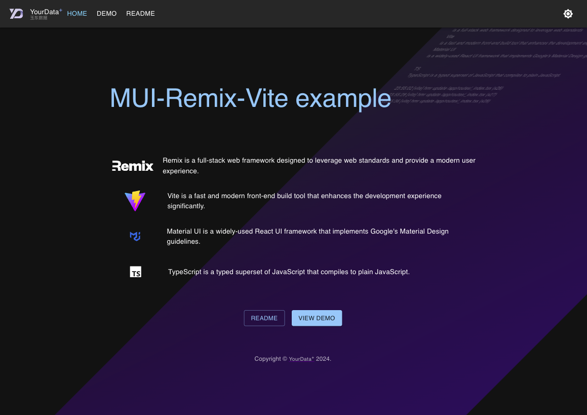

# MUI Remix Vite模板（MUI Remix Vite Template）

[在线体验](https://yourdata.plus)

[English](https://github.com/sunly8/MUI-Remix-Vite/blob/main/README.md) [中文](https://github.com/sunly8/MUI-Remix-Vite/blob/main/README_zh.md) 

## 概述

本项目是一个用于构建现代网络应用的模板，使用了**Material UI**、**Remix**和**Vite**。它结合了这些技术的强大功能，为开发响应式和视觉吸引力的用户界面提供了一个强大的基础。


## 特性

- **Material UI**: 利用全面的可定制UI组件库来创建美观和响应式的布局。
- **Remix**: 使用全栈框架优化路由和数据加载，提升整体开发体验。
- **Vite**: 享受快速的构建时间和热模块替换，实现流畅的开发过程。
- **服务器端渲染(SSR)**: 受益于内置的SSR支持，提高性能和SEO优化。
- **响应式设计**: 轻松实现适应不同屏幕尺寸的响应式布局和暗黑模式。

## 入门

### 前提条件

确保你已安装以下内容:

- Node.js (v18或更高版本)
- npm或yarn

### 安装

这是一个常规的 nodejs 项目，您需要掌握npm和nodejs的基础知识。我们精简了项目结构，让你使用最少的工作量，快速上手。只需要掌握最基本的 react 知识就可以快速开发最新的remix项目，并使用vite建构你的应用。

1. 创建项目:
   
使用 create-remix ：https://remix.org.cn/docs/en/main/guides/templates#community-stacks

   ```bash
   npx create-remix@latest --template sunly8/MUI-Remix-Vite
   ```

   or

   ```bash
   git clone https://github.com/sunly8/MUI-Remix-Vite
   cd MUI-Remix-Vite
   ```

2. 安装依赖:

   ```bash
   npm install
   ```

3. 运行开发服务器:

   ```bash
   npm run dev
   ```

4. 构建生产服务器:

   ```bash
   npm run build
   
   node server.js
   ```

5. 打开浏览器并导航到`http://localhost:5173`查看你的应用程序运行情况。

## 使用

模板包含了在Remix路由中使用Material UI组件的示例。


**"/public"** 目录中存放静态资源，你可以修改为自己的静态资源，比如logo等。

**"/routes"** 目录是remix的路由，demo.xxx提供了路由的示例，让你快速掌握remix开发。路由相关问题请参考   [Remix 路由](https://remix.run/docs/en/main/route/action) 。 你可以删除 demo.xxx 和 api.demo.xxx 文件，创建自己的路由。

**"/data"** 目录中存放演示数据，你可以修改为自己的数据，用于示范，在实践中可以改为您的自己的数据并删除不需要的文件。

**"./server"** 目录是remix的服务器端代码，你可以修改为自己的服务器端代码，用于示范，在实践中可以改为您的自己的代码并删除不需要的文件。您可以使用数据库模块在这里建立数据校验和数据库操作。

**"server.js"** 是 express 服务器端代码示例，用于演示自行部署生产环境的示例。生产环境只需要 build 目录和此文件。其他平台的部署方法请参考 [Remix 部署](https://vitejs.dev/guide/static-deploy.html) 。

```bash
npm run build
node server.js
# 访问 http://localhost:3000
```

**"/manifest.json"** 是 PWA 的配置文件，你可以修改为自己的配置。参考 [MDN](https://developer.mozilla.org/zh-CN/docs/Web/Manifest)

**"/src"** 目录中存放的是通用模块和react组件等，你需要查看并知晓各个文件的用途，决定去留。

## 贡献

欢迎贡献!如果你有建议或改进，请随时开issue或提交pull request。

## 许可证

本项目采用MIT许可证。详情请见[LICENSE](LICENSE)文件。

---

请随意进一步定制此模板以满足你项目的特定需求!如果你有任何问题或需要帮助，请随时联系。
